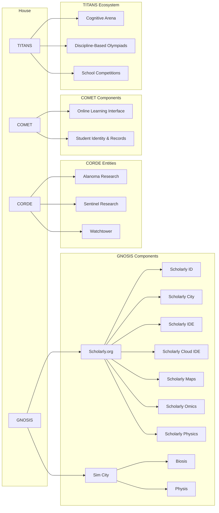
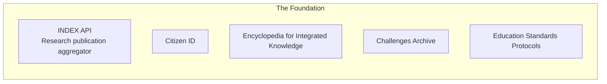

---
{"dg-publish":true,"dg-path":"Genesis/Research entities.md","permalink":"/genesis/research-entities/"}
---

## **[[Waypoint/Domains/The Foundation/The Foundation\|The Foundation]]** 
This the umbrella organization for funding and that will incorporate:

- [[Waypoint/Domains/The Foundation/First Foundation/Foundations for Education/Academic & Research Council/Research INDEX API\|Research INDEX API]]: (Integrated Database for Established Research) can serve as a comprehensive knowledge and publication aggregator, providing structured access to research papers, books, journals, reports, and other academic or non-academic written works.
- [[Waypoint/Domains/The Foundation/First Foundation/Foundations for Technology/Citizen ID\|Citizen ID]]: ID Database, integrated for authentication.
- [[Waypoint/Domains/The Foundation/First Foundation/Foundations for Education/Academic & Research Council/The Encyclopedia\|The Encyclopedia]]: A real-time, continuously updated encyclopedia that acts as a living, GitHub-like repository of Knowledge Encyclopedia.
-  **Open Challenges Archive**: Free, public repository of problems and simulations
- **Open Education Standards**: Course metadata schema, learning progress interoperability, API specs  
## The Research and Education Division of House
### [[Waypoint/Domains/The Great Houses/House of El Han/Ministry of Education & Research/GNOSIS, Inc/GNOSIS, Inc\|GNOSIS, Inc]]
- **[[Waypoint/Domains/The Great Houses/House of El Han/Ministry of Education & Research/GNOSIS, Inc/Scholarly/Scholarly.org\|Scholarly.org]]:** The central client app for Research INDEX—a dynamic, interactive, and universally accessible repository for research.
	- User libraries, connected notes, ai chats and so on.
	- [[scholarly ID\|scholarly ID]] :  Scholarly and User Management and Authentication Backend.
	- [[Waypoint/Domains/The Great Houses/House of El Han/Ministry of Education & Research/GNOSIS, Inc/Scholarly/Scholarly City\|Scholarly City]]: A potential social network or collaborative space that connects folks, discussion, and facilitates data sharing.
		- Forums, Private communities 
	- [[Cortex/Genesis/Scholarly Notebook\|Scholarly Notebook]]: The Ultimate One
		- Cross-platform
		- Local-first, file based 
		- Personal and Group Servers > Multiple Vaults
	- [[Scholarly Cloud IDE\|Scholarly Cloud IDE]]
		- Storage
		- Co-lab on specific files or directories 
	- [[Scholarly Maps\|Scholarly Maps]]
	- [[Waypoint/Domains/The Great Houses/House of El Han/Ministry of Education & Research/GNOSIS, Inc/Scholarly/scholarly omics\|scholarly omics]]
	- [[Waypoint/Domains/The Great Houses/House of El Han/Ministry of Education & Research/GNOSIS, Inc/Scholarly/scholarly linguistics\|scholarly linguistics]]
	- [[Waypoint/Domains/The Great Houses/House of El Han/Ministry of Education & Research/GNOSIS, Inc/Scholarly/Scholarly ilm\|Scholarly ilm]]
	- [[Scholarly physics\|Scholarly physics]]
- [[Waypoint/Domains/The Great Houses/House of El Han/Ministry of Education & Research/GNOSIS, Inc/Biosis/Biosis\|Biosis]]: A cloud-native software suite that empowers scientists, engineers, and creators to design, simulate, and build living systems—from DNA sequences to full synthetic organisms.
- [[Waypoint/Domains/The Great Houses/House of El Han/Ministry of Education & Research/GNOSIS, Inc/Physis\|Physis]]

### [[Waypoint/Domains/The Great Houses/House of El Han/Ministry of Technology/Han's Labs/The Software Labs/Comet Technologies\|Comet Technologies]]
A Federated Online Study Platform Student management and learning managemenet app build on the protocols of  The Foundation
- [[Alpenglow\|Alpenglow]]

### **[[Waypoint/Domains/The Great Houses/House of El Han/Ministry of Education & Research/NERVE, Inc/NERVE, Inc\|NERVE, Inc]]** 
This a separate entity representing the research institutions. These institutions can publish independently, but may also interface with the Foundation’s components.
- [[Waypoint/Domains/The Great Houses/House of El Han/Ministry of Education & Research/NERVE, Inc/Alanoma Research/Alanoma Research\|Alanoma Research]]
- [[Waypoint/Domains/The Great Houses/House of El Han/Ministry of Education & Research/NERVE, Inc/Elixir Research\|Elixir Research]]
- [[Waypoint/Domains/The Great Houses/House of El Han/Ministry of Education & Research/NERVE, Inc/Allele Research\|Allele Research]]

### [[Waypoint/Domains/The Great Houses/House of El Han/Ministry of Education & Research/NERVE, Inc/New Olympians/New Olympians\|New Olympians]]

## **Publications & Dissemination** 
It can either be integrated with Foundation or managed separately. They represent the diverse channels where research outputs are published, archived, and disseminated repositories, depending on the structure of ecosystem. Future thingy.
- [[Waypoint/Domains/The Great Houses/House of El Han/Ministry of Arts and Culture/The Publishing House/The Publishing House\|The Publishing House]]
	- 

---

