---
{"dg-publish":true,"dg-path":"Genesis/Research entities.md","permalink":"/genesis/research-entities/"}
---

## **[[Waypoint/Domains/The Foundation/The Foundation\|The Foundation]]** 
This the umbrella organization for funding and that will incorporate:

- [[Waypoint/Domains/The Foundation/Educational Board and Institutions/Research INDEX API\|Research INDEX API]]: (Integrated Database for Established Research) can serve as a comprehensive knowledge and publication aggregator, providing structured access to research papers, books, journals, reports, and other academic or non-academic written works.
- [[Waypoint/Domains/The Foundation/Digital & Technological Innovation/Citizen ID\|Citizen ID]]: ID Database, integrated for authentication.
- [[Waypoint/Domains/The Foundation/Educational Board and Institutions/Encyclopedia for Integrated Knowledge\|Encyclopedia for Integrated Knowledge]]: A real-time, continuously updated encyclopedia that acts as a living, GitHub-like repository of Knowledge Encyclopedia.
-  **Open Challenges Archive**: Free, public repository of problems and simulations
- **Open Education Standards**: Course metadata schema, learning progress interoperability, API specs  
## The Research and Education Division of House
### [[Waypoint/Domains/House of El Han/Ministry of Research & Education/GNOSIS/GNOSIS\|GNOSIS]]
- **[[Portfolio/Projects/Scholarly.org\|Scholarly.org]]:** The central client app for Research INDEX—a dynamic, interactive, and universally accessible repository for research.
	- User libraries, connected notes, ai chats and so on.
	- [[scholarly ID\|scholarly ID]] :  Scholarly and User Management and Authentication Backend.
	- [[Cortex/Genesis/Scholarly City\|Scholarly City]]: A potential social network or collaborative space that connects folks, discussion, and facilitates data sharing.
		- Forums
		- Private communities 
		- Messaging 
	- [[Cortex/Genesis/Scholarly IDE\|Scholarly IDE]]: The Ultimate One
		- Cross-platform
		- Local-first, file based 
		- Personal and Group Servers > Multiple Vaults
	- [[Scholarly Cloud IDE\|Scholarly Cloud IDE]]
		- Storage
		- Co-lab on specific files or directories 
	- [[Scholarly Maps\|Scholarly Maps]]
	- [[Portfolio/Projects/scholarly omics\|scholarly omics]]
	- [[scholarly physics\|scholarly physics]]
- [[Waypoint/Domains/House of El Han/Ministry of Research & Education/GNOSIS/Biosis/Biosis\|Biosis]]: A cloud-native software suite that empowers scientists, engineers, and creators to design, simulate, and build living systems—from DNA sequences to full synthetic organisms.
- [[Waypoint/Domains/House of El Han/Ministry of Technology/Han's Labs/Physis\|Physis]]

### [[Waypoint/Domains/House of El Han/Ministry of Research & Education/COMET/COMET\|Comet]]
    Federated Online Study Platform
- [[Alpenglow\|Alpenglow]]: Student management and learning managemenet app build on the protocols of  The Foundation

### **[[Waypoint/Domains/House of El Han/Ministry of Research & Education/CORDE/CORDE\|CORDE]]** 
This a separate entity representing the research institutions. These institutions can publish independently, but may also interface with the Foundation’s components.
- [[Waypoint/Databank/Οrganisations/Alpha/2. Research and Policy Institutions/Alanoma Research\|Alanoma Research]]

### [[Waypoint/Domains/House of El Han/Ministry of Research & Education/TITANS/TITANS\|TITANS]]

## **Publications & Dissemination** 
It can either be integrated with Foundation or managed separately. They represent the diverse channels where research outputs are published, archived, and disseminated repositories, depending on the structure of ecosystem. Future thingy.

---
Unrelated 
- **[[Portfolio/Projects/Motherframe\|Motherframe]]**
- REVER Engine
	- [[Portfolio/Projects/Cellverse\|Cellverse]]
- [[Waypoint/Domains/House of El Han/Ministry of Research & Education/CORDE/Sentinel - Market Intelligence\|Sentinel - Market Intelligence]]
- [[Cortex/Genesis/Shaman - Medical Intelligence\|Shaman - Medical Intelligence]]
- [[Cortex/Genesis/Lightscope - Predictive Intelligence\|Lightscope - Predictive Intelligence]]
- [[Mother - Multimodal Generative Intelligence\|Mother - Multimodal Generative Intelligence]]
- [[orisis technologies\|orisis technologies]]

```mermaid
graph TD

  subgraph House ["House"]
    GNOSIS["GNOSIS"]
    COMET["COMET"]
    CORDE["CORDE"]
    TITANS["TITANS"]
  end

  subgraph GNOSIS_Sub ["GNOSIS Components"]
    Scholarly_org["Scholarly.org<br>Central client app for Research INDEX<br>User libraries, notes, AI chats"]
    Scholarly_ID["Scholarly ID<br>User Management & Authentication Backend"]
    Scholarly_City["Scholarly City<br>Social & Collaboration"]
    Forums["Forums"]
    Private_Communities["Private communities"]
    Messaging["Messaging"]
    Scholarly_IDE["Scholarly IDE<br>Cross-platform, local-first, file based<br>Personal & Group Servers > Multiple Vaults"]
    Scholarly_Cloud_IDE["Scholarly Cloud IDE<br>Storage & Co-lab"]
    Scholarly_Maps["Scholarly Maps"]
    Scholarly_Omics["Scholarly Omics"]
    Scholarly_Physics["Scholarly Physics"]
    Biosis["Biosis<br>Cloud-native synthetic biology software suite"]
    Physis["Physis"]
  end

  subgraph CORDE_Sub ["CORDE Entities"]
    Alanoma["Alanoma Research"]
  end

  subgraph Foundation ["The Foundation"]
    Research_INDEX_API["Research INDEX API<br>Knowledge & publication aggregator"]
    Citizen_ID["Citizen ID<br>Authentication database"]
    Encyclopedia["Encyclopedia for Integrated Knowledge<br>Live GitHub-like repo"]
    Open_Challenges["Open Challenges Archive<br>Public problems & simulations"]
    Open_Edu_Standards["Open Education Standards<br>Course metadata, APIs"]
  end

  %% House components links
  House --> GNOSIS
  House --> COMET
  House --> CORDE
  House --> TITANS

  %% GNOSIS children
  GNOSIS --> Scholarly_org
  Scholarly_org --> Scholarly_ID
  Scholarly_org --> Scholarly_City
  Scholarly_City --> Forums
  Scholarly_City --> Private_Communities
  Scholarly_City --> Messaging
  Scholarly_org --> Scholarly_IDE
  Scholarly_org --> Scholarly_Cloud_IDE
  Scholarly_org --> Scholarly_Maps
  Scholarly_org --> Scholarly_Omics
  Scholarly_org --> Scholarly_Physics
  Scholarly_org --> Biosis
  Scholarly_org --> Physis

  %% CORDE children
  CORDE --> Alanoma

  %% Foundation children
  Foundation --> Research_INDEX_API
  Foundation --> Citizen_ID
  Foundation --> Encyclopedia
  Foundation --> Open_Challenges
  Foundation --> Open_Edu_Standards
```

